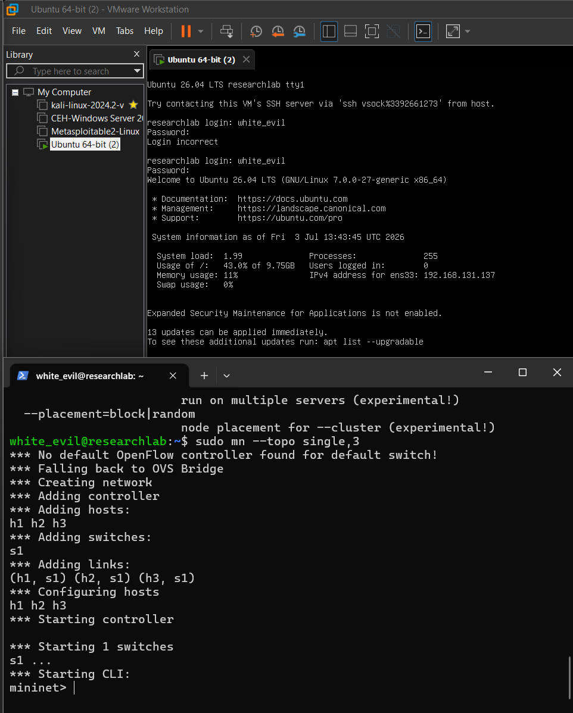
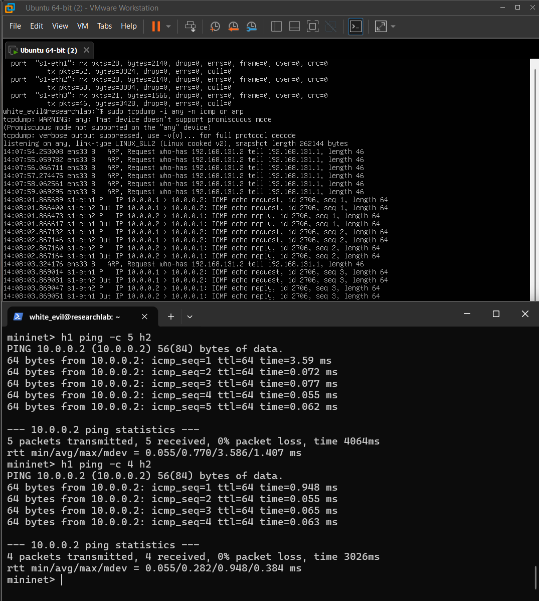

# Experiment 01 Solution

## Experiment Title

**Traditional Network Architecture using Mininet**

---

# Objective

The objective of this experiment is to understand the architecture and operation of a traditional Layer-2 computer network using Mininet and Open vSwitch. The experiment demonstrates Ethernet communication, MAC address learning, ARP resolution, ICMP communication, and packet forwarding in a software-defined laboratory environment.

---

# Lab Environment

| Component | Version |
|-----------|----------|
| Ubuntu Server | 26.04 LTS |
| Mininet | 2.3.0 |
| Open vSwitch | 3.7.1 |
| Python | 3.14.4 |
| tcpdump | Installed |
| nmap | Installed |
| traceroute | Installed |
| iperf3 | Installed |

---

# Environment Verification

### Mininet

```bash
mn --version
```

Output

```text
2.3.0
```

---

### Open vSwitch

```bash
ovs-vsctl --version
```

Output

```text
ovs-vsctl (Open vSwitch) 3.7.1
```

---

### Python

```bash
python3 --version
```

Output

```text
Python 3.14.4
```

---

### Network Analysis Tools

```bash
which tcpdump
which nmap
which traceroute
which iperf3
```

All required tools were successfully installed.

---

# Creating the Topology

Command

```bash
sudo mn --topo single,3
```

Mininet successfully created

- 3 Hosts
- 1 Open vSwitch
- Virtual Ethernet Links

---

# Topology

```
             +-------------+
             |     s1      |
             | Open vSwitch|
             +-------------+
            /      |       \
           /       |        \
         h1        h2        h3
```

---

## Topology Screenshot



---

# Network Information

## net

```bash
net
```

Output

```text
h1 h1-eth0:s1-eth1
h2 h2-eth0:s1-eth2
h3 h3-eth0:s1-eth3
```

This confirms each host is connected to one switch interface.

---

## Open vSwitch Configuration

Command

```bash
sh ovs-vsctl show
```

Important observations

- Bridge s1 created successfully
- Operating in standalone mode
- No SDN controller attached
- Functions as a traditional Layer-2 switch

---

## Host Information

Command

```bash
dump
```

Output

```text
h1 -> 10.0.0.1

h2 -> 10.0.0.2

h3 -> 10.0.0.3
```

All hosts belong to the same subnet (10.0.0.0/8), allowing communication through switching without requiring a router.

---

# Connectivity Test

Command

```bash
pingall
```

Output

```text
*** Results: 0% dropped (6/6 received)
```

Observation

All hosts communicated successfully without packet loss.

---

# MAC Address Learning

Command

```bash
sh ovs-appctl fdb/show s1
```

Output

```text
port  VLAN  MAC                Age

1     0     8a:73:9c:e8:cc:bd

2     0     4a:7c:9b:f4:be:6a

3     0     22:b2:6f:65:71:92
```

Observation

The switch dynamically learned MAC addresses and associated each MAC with its corresponding switch port.

---

# Packet Capture

Command

```bash
sudo tcpdump -i any -n icmp or arp
```

Traffic generated

```bash
h1 ping -c 4 h2
```

Observed packets

- ARP Requests
- ARP Replies
- ICMP Echo Request
- ICMP Echo Reply

---

## Packet Capture Screenshot



---

# Packet Flow

```
Application
      │
      ▼
ICMP
      │
      ▼
IP
      │
      ▼
ARP (MAC Resolution)
      │
      ▼
Ethernet Frame
      │
      ▼
Open vSwitch
      │
      ▼
Destination Host
```

---

# Explanation

## ARP

Before sending an ICMP packet, Host h1 must determine the MAC address of h2.

The ARP protocol broadcasts a request asking:

```
Who has 10.0.0.2?
```

Host h2 replies with its MAC address.

---

## ICMP

Once the MAC address is known, h1 sends an ICMP Echo Request.

Host h2 responds with an ICMP Echo Reply.

This sequence forms the basis of the ping command.

---

## MAC Learning

Open vSwitch learns the source MAC address of every incoming Ethernet frame.

The switch stores

```
MAC Address

↓

Switch Port
```

This allows future packets to be forwarded directly without broadcasting.

---

# RTT Analysis

Example

```
First Ping

3.59 ms
```

Subsequent pings

```
0.07 ms

0.06 ms

0.05 ms
```

The first ping requires ARP resolution and MAC learning.

Subsequent packets are faster because the required information is already cached.

---

# Learning Outcomes

After completing this experiment, the following concepts were understood.

- Traditional Layer-2 Networking
- Ethernet Communication
- Open vSwitch
- Linux Network Namespaces
- MAC Address Learning
- ARP
- ICMP
- Ping
- Packet Forwarding
- Packet Capture using tcpdump

---

# Research Relevance

This experiment establishes the foundation of traditional Ethernet networking by demonstrating Layer-2 communication, MAC address learning, and packet forwarding using Open vSwitch operating in standalone mode.

Understanding how conventional switches forward traffic without centralized control provides the baseline for subsequent experiments involving Software Defined Networking (SDN), Autonomic Networking (ANIMA), and the proposed Cognitive Autonomic Service Agent (C-ASA).

This experiment serves as the first step toward evaluating how intelligent autonomous networking architectures improve upon traditional rule-based networking.

---

# Conclusion

The experiment successfully demonstrated the operation of a traditional Layer-2 network using Mininet and Open vSwitch.

Three virtual hosts communicated successfully through an Open vSwitch bridge. MAC address learning, ARP resolution, ICMP communication, and packet forwarding were observed and analyzed using tcpdump.

The experiment provides the practical networking foundation required for the remaining experiments in this research, particularly Software Defined Networking, Autonomic Networking, and the proposed Cognitive Autonomic Service Agent (C-ASA).