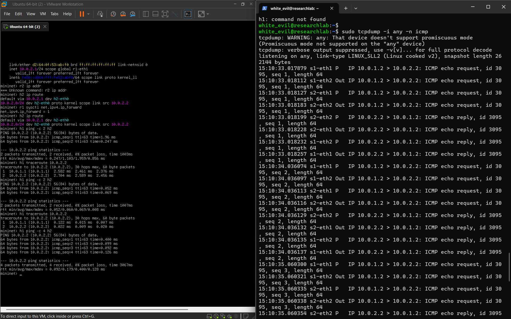

# Experiment 02 Solution

# Title

Static Routing and Basic Network Connectivity using Linux Router

---

# Objective

The objective of this experiment is to configure Linux as a router using Mininet and understand packet forwarding between two different IP networks.

---

# Lab Environment

| Component | Version |
|------------|----------|
| Ubuntu Server | 26.04 LTS |
| Python | 3.14 |
| Mininet | 2.3.0 |
| Open vSwitch | 3.7.1 |

---

# Theory

Unlike Layer-2 switches, routers operate at Layer-3 of the OSI model. A router examines the destination IP address of incoming packets and forwards them based on entries stored in its routing table.

In this experiment, Linux is configured to perform routing by enabling IPv4 forwarding.

---

# Network Topology

```
      10.0.1.0/24              10.0.2.0/24

        h1
         |
        s1
         |
     r1 (Linux Router)
         |
        s2
         |
        h2
```

---

## Topology Screenshot


---

# IP Addressing

| Device | Interface | IP Address |
|----------|-----------|------------|
| h1 | h1-eth0 | 10.0.1.2/24 |
| r1 | r1-eth0 | 10.0.1.1/24 |
| r1 | r1-eth1 | 10.0.2.1/24 |
| h2 | h2-eth0 | 10.0.2.2/24 |

---

# Procedure

## Step 1

Create the custom topology using Python.

---

## Step 2

Run the topology.

```bash
sudo python3 exp02_static_router.py
```

---

## Step 3

Verify topology.

```bash
net
```

---
## setup screenshot

[Routing](images/exp_2_pic_1.png)

---


## Step 4

Verify router interfaces.

```bash
r1 ip addr
```

---

## Step 5

Verify IP forwarding.

```bash
r1 sysctl net.ipv4.ip_forward
```

Output

```
net.ipv4.ip_forward = 1
```

---

## Step 6

Verify routing tables.

```bash
h1 ip route

h2 ip route
```

---

## Step 7

Connectivity Test

```bash
h1 ping -c 4 h2
```

Result

```
0% packet loss
```

Communication was successful between different subnets.

---

## Step 8

Packet Capture

```bash
sudo tcpdump -i any -n icmp
```

Generate traffic

```bash
h1 ping -c 4 h2
```

---

## Packet Capture Screenshot



---

# Packet Flow

```
h1

↓

Switch 1

↓

Linux Router

↓

Switch 2

↓

h2
```

Reply

```
h2

↓

Switch 2

↓

Linux Router

↓

Switch 1

↓

h1
```

---

# Observations

- Linux successfully performed Layer-3 routing.
- IP forwarding was enabled.
- Hosts communicated across different subnets.
- Open vSwitch performed Layer-2 forwarding.
- Linux router forwarded packets using its routing table.
- ICMP Echo Requests and Echo Replies were successfully captured.

---

# Difference Between Experiment 01 and Experiment 02

| Experiment 01 | Experiment 02 |
|---------------|---------------|
| Layer-2 Switching | Layer-3 Routing |
| Same Subnet | Different Subnets |
| Switch Only | Linux Router |
| MAC Address Forwarding | IP Address Forwarding |

---

# Learning Outcomes

This experiment provided practical understanding of:

- Linux Routing
- Static Routing
- IP Forwarding
- Routing Tables
- Default Gateway
- Packet Forwarding
- ICMP Communication
- tcpdump Analysis

---

# Research Relevance

This experiment extends the concepts introduced in Experiment 01 by demonstrating Layer-3 routing using a Linux router. It forms the foundation for Software Defined Networking (SDN), where forwarding decisions are separated from network devices and controlled centrally.

Understanding traditional routing behavior is essential before implementing SDN controllers, ANIMA autonomic networking concepts, and the proposed Cognitive Autonomic Service Agent (C-ASA) architecture.

---

# Conclusion

The experiment successfully demonstrated Layer-3 communication between two different IP networks using a Linux router. Static routing and IP forwarding enabled successful packet delivery between hosts located in different subnets. Packet capture verified the routing process and illustrated how routers forward packets based on destination IP addresses.